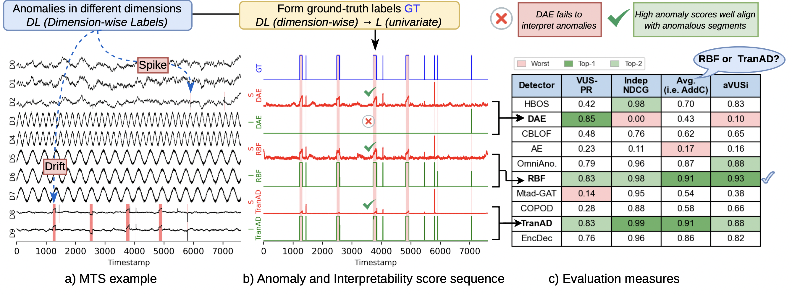
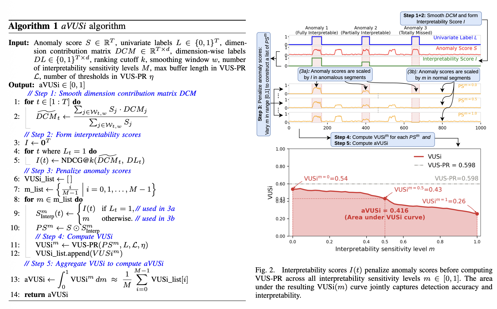

# aVUSi: Joining Accuracy and Interpretability Evaluation Measures for Time Series Anomaly Detection

> **Interpretable or Accurate? or Both? Joining Accuracy and Interpretability Evaluation Measures for Time Series Anomaly Detection**  
> *Thu T. H. Doan, Emmanouil Sylligardos, Astrid Marie Skålvik, Rogardt Heldal, Themis Palpanas, Patrizio Pelliccione, Paul Boniol*  
> Gran Sasso Science Institute · ENS, PSL, CNRS, Inria · University of Bergen, NORCE · Western Norway University of Applied Sciences · Université Paris Cité

---

## Overview

**aVUSi** is a novel evaluation metric for Multivariate Time Series Anomaly Detection (MTS-AD) that jointly captures **detection accuracy** and **interpretability** in a single quantitative measure. Unlike existing metrics that evaluate the two aspects independently, aVUSi integrates interpretability scores directly into the anomaly score sequence before computing detection performance, penalizing detectors that fail to identify the dimensions responsible for detected anomalies even when their detection accuracy is high.

aVUSi builds upon **VUS-PR** — a threshold-independent, range-based accuracy metric published at VLDB — and extends it by incorporating dimension-wise interpretability evaluation via NDCG@k.

---

## Motivation



Existing anomaly detection benchmarks primarily focus on detection accuracy and treat interpretability as a separate post-hoc analysis. This disconnect makes it difficult to systematically compare detectors that trade one aspect against the other. For example:

- A detector may achieve strong detection accuracy while **completely failing** to identify which dimensions caused the anomaly (e.g., DAE: VUS-PR = 0.85, IndepNDCG = 0.00).
- A detector may provide highly accurate explanations but only moderate detection accuracy (e.g., HBOS: VUS-PR = 0.42, IndepNDCG = 0.98).
- Two detectors may achieve identical accuracy and interpretability scores independently, yet behave very differently in practice (e.g., TranAD vs. RBF: both VUS-PR = 0.83, both IndepNDCG ≈ 0.99, yet aVUSi = 0.88 vs. 0.93).

aVUSi addresses this gap by providing a **unified, threshold-independent** measure that rewards detectors that are both accurate and interpretable.

---

## Illustration of aVUSi



aVUSi proceeds in five steps (see Algorithm 1 and Figure 1 in the paper). More details on each step are provided in module `3_metric_calculator/README.md.`

### Hyperparameters

| Parameter | Description | Default | Recommendation |
|---|---|---|---|
| `k` | NDCG ranking cutoff | 5 | Select based on domain knowledge; start with k ≈ d/3 |
| `w` | Smoothing window size | 10 | w ∈ [5, 10] provides stable results |
| `M` | Number of sensitivity levels | 50 | M = 20 is sufficient; M = 50 for smoother curve |

**Note:** aVUSi is most sensitive to `k`. Smaller `k` provides stricter interpretability evaluation; larger `k` rewards broader coverage of anomalous dimensions.


### Time Complexity

| Step | Operation | Complexity |
|---|---|---|
| Step 1 | Smoothing DCM | O(T · w · d) |
| Step 2 | Computing I via NDCG@k | O(\|T_A\| · d log d) |
| Steps 3–5 | Penalizing and aggregating | O(η · τ · M) |
| **Total** | | **O(T · w · d + \|T_A\| · d log d + η · τ · M)** |

In practice, aVUSi is approximately 20× slower than VUS-PR and 2× slower than IndepNDCG. Since evaluation is performed **offline** after detector inference, this overhead does not affect detector runtime.

---

[//]: # (### Step 1 — Smooth the Dimension Contribution Matrix &#40;DCM&#41;)

[//]: # (The **DCM** encodes, for each timestamp t, a normalized distribution over dimensions representing how much each dimension contributes to the anomaly score. To handle fluctuating contributions in range-based anomalies, score-weighted averaging is applied over a smoothing window of size `w`:)

[//]: # ()
[//]: # ($$\tilde{c}_t = \frac{\sum_{j \in \mathcal{W}_{t,w}} s_j \cdot c_j}{\sum_{j \in \mathcal{W}_{t,w}} s_j}$$)

[//]: # ()
[//]: # (### Step 2 — Form the Interpretability Score Sequence)

[//]: # (Interpretability is formulated as a **ranking problem**: the smoothed DCM induces a ranking of dimensions by decreasing contribution, and a good detector should place truly anomalous dimensions at the top. Interpretability at each anomalous timestamp t is evaluated using **NDCG@k**:)

[//]: # ()
[//]: # ($$I&#40;t&#41; = \text{NDCG@}k&#40;t&#41; \in [0, 1]$$)

[//]: # ()
[//]: # (- **Fully Interpretable** &#40;I&#40;t&#41; = 1&#41;: all anomalous dimensions occupy the top-k positions exclusively.)

[//]: # (- **Partially Interpretable** &#40;0 < I&#40;t&#41; < 1&#41;: anomalous dimensions appear only partially within top-k, or are outranked by normal dimensions.)

[//]: # (- **Totally Missed** &#40;I&#40;t&#41; = 0&#41;: no anomalous dimension appears within top-k.)

[//]: # ()
[//]: # (### Step 3 — Penalize Anomaly Scores)

[//]: # (For each sensitivity level m ∈ [0, 1], construct the penalized anomaly score sequence:)

[//]: # ()
[//]: # ($$PS^m = S \odot S^m_{\text{Interp}}, \quad \text{where} \quad S^m_{\text{Interp}}&#40;t&#41; = \begin{cases} I&#40;t&#41;, & L_t = 1 \\ m, & \text{otherwise} \end{cases}$$)

[//]: # ()
[//]: # (### Step 4 — Compute $VUSi^m$)

[//]: # (For each sensitivity level m, compute VUS-PR on the penalized scores:)

[//]: # ()
[//]: # ($$\text{VUSi}^m = \text{VUS-PR}&#40;PS^m&#41;$$)

[//]: # ()
[//]: # (### Step 5 — Aggregate to obtain aVUSi)

[//]: # (aVUSi is the area under the VUSi&#40;m&#41; curve as m sweeps from 0 to 1:)

[//]: # ()
[//]: # ($$\text{aVUSi}&#40;X&#41; = \int_0^1 \text{VUSi}^m dm \approx \frac{1}{M} \sum_{i=0}^{M-1} \text{VUSi}^{m_i}$$)

[//]: # ()
[//]: # (---)

[//]: # ()
[//]: # (## Theoretical Properties)

[//]: # ()
[//]: # (| Property | Statement |)

[//]: # (|---|---|)

[//]: # (| **Boundedness** | aVUSi&#40;X&#41; ∈ [0, 1] for any MTS X |)

[//]: # (| **Monotonicity** | If interpretability improves pointwise, aVUSi does not decrease |)

[//]: # (| **Consistency** | When all anomalous timestamps are fully interpretable, aVUSi ≥ VUS-PR&#40;S&#41; |)

[//]: # ()
[//]: # (---)

[//]: # (---)

[//]: # ()
[//]: # (## Detectors)

[//]: # ()
[//]: # (The following 10 interpretable detectors are evaluated in the paper, grouped by category:)

[//]: # ()
[//]: # (| Category | Detector | Strategy |)

[//]: # (|---|---|---|)

[//]: # (| Classical ML | HBOS | Distribution-based &#40;histogram density&#41; |)

[//]: # (| Classical ML | RBF | Forecasting-based &#40;random forest ensemble&#41; |)

[//]: # (| Outlier Detection | CBLOF | Clustering-based &#40;cluster size and distance&#41; |)

[//]: # (| Outlier Detection | COPOD | Distribution-based &#40;copula tail probabilities&#41; |)

[//]: # (| Deep Learning | AE | Reconstruction-based &#40;autoencoder&#41; |)

[//]: # (| Deep Learning | DAE | Reconstruction-based &#40;denoising autoencoder&#41; |)

[//]: # (| Deep Learning | EncDec-AD | Reconstruction-based &#40;LSTM encoder-decoder&#41; |)

[//]: # (| Deep Learning | TranAD | Forecasting-based &#40;transformer + adversarial&#41; |)

[//]: # (| Deep Learning | OmniAnomaly | Reconstruction-based &#40;stochastic RNN + normalizing flows&#41; |)

[//]: # (| Deep Learning | MTAD-GAT | Forecasting + reconstruction &#40;graph attention network&#41; |)

[//]: # ()
[//]: # (For each detector, the DCM is derived from per-dimension prediction errors, reconstruction errors, density scores, or distance decompositions, normalized via softmax at each timestamp.)

[//]: # ()
[//]: # (---)

## Summary of Experimental Evaluation
### Datasets

| Dataset | Domain | # Dim. | # Subsets | Avg. Length | Avg. Anomaly Ratio |
|---|---|---|---|---|---|
| Synthetic | Sensor | 10 | 974 | 6,536 | 7.23% |
| SMD | Server Machine | 38 | 28 | 25,300 | 4.2% |

Both datasets provide **dimension-wise ground-truth labels**, which are required for quantitative interpretability evaluation. The synthetic dataset is generated using an extended version of [synthsensor](https://github.com/astridmariesk/synthsensor), adapted to support higher-dimensional MTS.

---

### Overal Results

#### Synthetic Dataset (top detectors by each measure)

| Detector | VUS-PR | IndepNDCG | aVUSi |
|---|---|---|---|
| AvgEns | — | — | **Best** |
| TranAD | **Best** | — | 3rd |
| RBF | — | **Best** | 2nd |

#### SMD Dataset (top detectors by each measure)

| Detector | VUS-PR | IndepNDCG | aVUSi |
|---|---|---|---|
| AvgEns | **Best** | 2nd | **Best** |
| CBLOF | 2nd | — | — |
| COPOD | — | **Best** | 2nd |

Key finding: **AvgEns (Average Ensemble) consistently ranks first under aVUSi** on both datasets, demonstrating that ensembling effectively balances accuracy and interpretability.

---

[//]: # (## Citation)

[//]: # ()
[//]: # (```bibtex)

[//]: # (@inproceedings{doan2026avusi,)

[//]: # (  title     = {Interpretable or Accurate? or Both? Joining Accuracy and )

[//]: # (               Interpretability Evaluation Measures for Time Series Anomaly Detection},)

[//]: # (  author    = {Doan, Thu T. H. and Sylligardos, Emmanouil and Sk{\aa}lvik, Astrid Marie )

[//]: # (               and Heldal, Rogardt and Palpanas, Themis and Pelliccione, Patrizio )

[//]: # (               and Boniol, Paul},)

[//]: # (  booktitle = {IEEE International Conference on Data Engineering &#40;ICDE&#41;},)

[//]: # (  year      = {2026})

[//]: # (})

[//]: # (```)

[//]: # ()
[//]: # (---)

## Related Work

This work builds directly on:

- **VUS-PR** — Boniol et al., *VUS: Effective and Efficient Accuracy Measures for Time-Series Anomaly Detection*, VLDB Journal 2025.
- **synthsensor** — Skålvik, *Synthsensor: Synthetic Two-Sensor Time Series with Labeled Anomalies*, v0.1.0, 2025.

---

## Installation

```bash
git clone https://github.com/doanthihoaithu/aVUSi.git
cd aVUSi
pip install -r requirements.txt
```

**Requirements:**
- Python 3.11
- PyTorch 2.1
- TensorFlow 2.15
- CUDA 11.8 (optional, for GPU acceleration)

---

## Usage

```python
from avusi import compute_avusi

# Inputs
# S     : anomaly score sequence, shape (T,)
# L     : univariate labels, shape (T,)
# DCM   : dimension contribution matrix, shape (T, d)
# DL    : dimension-wise labels, shape (T, d)

score = compute_avusi(
    S=S,
    L=L,
    DCM=DCM,
    DL=DL,
    k=5,       # NDCG ranking cutoff
    w=10,      # smoothing window size
    M=50,      # number of sensitivity levels
)
print(f"aVUSi = {score:.4f}")
```

## License

This project is licensed under the MIT License. See `LICENSE` for details.

---

## Contact

- Thu T. H. Doan — thihoaithu.doan@gssi.it